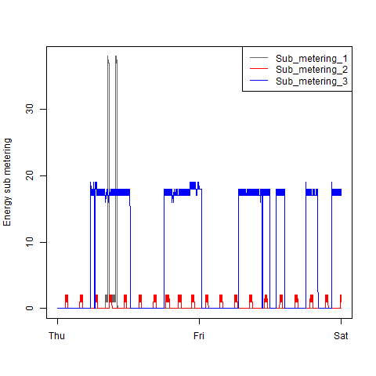
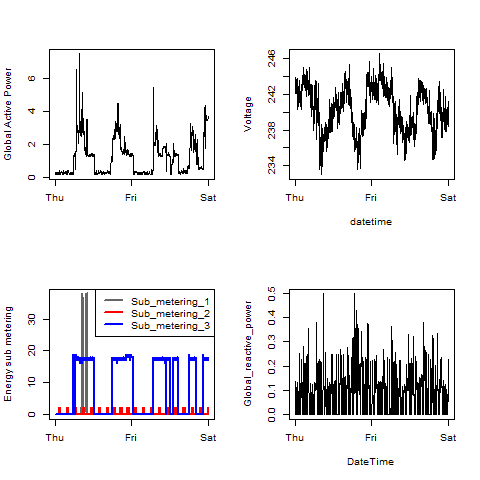

## 0. Introduction

This document consists of 3 parts:

1. Contents of the repository - Describes the main folders of this repository.
2. The scripts - Explains the scripts that created the 4 plots.
3. References - External and internal references

---

## 1. Contents of the repository

The main folder contains my 8 files for this assignment:

* plot1.png, plot2.png, plot3.png and plot4.png - The 4 plots I had to create for this assignment.
* plot4.R, plot4.R, plot4.R and plot4.R - The 4 R-scripts that created abovementioned png-files.

Furthermore, the main folder contains this README file:
It consists of the original README file from the assignment, preceded by my 3 chapters.

There is also an unchanged subfolder, which contains the 4 pictures that are used at the end of (the original part of) this document.

---

## 2. The scripts

This section explains the 4 scripts I used to create the plots:

1. What I did before I first read the data file
2. plot1.R - The code which produces plot1.png
3. plot2.R - The code which produces plot2.png
4. plot3.R - The code which produces plot3.png
5. plot4.R - The code which produces plot4.png
6. The common part of plot1.R, plot2.R, plot3.R and plot4.R

### 2.1 A first look at the data file.

Before I first read the dataset, I did some preparation.

First I loaded a tiny part of the document to see the structure:

    temp100  <- read.table("data/household_power_consumption.txt", na.strings = "?", nrows=100)
    str(temp100)
    head(temp100)
    
I saw that everything ended up in the first column, and the data seemed to be european-style csv (semicolon-separated). This kind of file can be read best using read.csv2.

    temp100  <- read.csv2("data/household_power_consumption.txt", na.strings = "?", nrows=100)
    temp1000 <- read.csv2("data/household_power_consumption.txt", na.strings = "?", nrows=1000)
    
    object.size(temp100)        ## 32240 bytes
    object.size(temp1000)       ## 198104 bytes

So 2'075'259 rows might take up allmost 400 MB. That's not a problem on this computer.

    dim(temp1000[temp1000$Date=="17/12/2006", ])    ## [1] 604   9
    dim(temp1000[temp1000$Date=="16/12/2006", ])    ## [1] 396   9

So the data format doesn't give a problem. Dates seem to be european style.

### 2.3 Script: plot1.R

This R-script creates plot1.png

To run this script, first set the working directory to the main folder of this repository, and execute:

    source "plot1.R"

The script starts with a common part (see section 2.7), which essentally loads the relevant subset of the dataset) and continues as follows:

    ## Creating Plot 1:
    png(filename="plot1.png",
        width=480, height=480
    )
    with(hpcSubset,
        hist(Global_active_power,
            col="red",
            main="Global Active Power",
            xlab="Global Active Power (kilowatts)")
    )
    dev.off()

The script creates this plot:

### 2.4 Script: plot2.R

This R-script creates plot1.png

To run this script, first set the working directory to the main folder of this repository, and execute:

    source "plot2.R"

The script starts with a common part (see section 2.7), which essentally loads the relevant subset of the dataset) and continues as follows:

    ## Creating Plot 2:
    png(filename="plot2.png",
        width=480, height=480
    )
    with(hpcSubset,
        plot(DateTime, Global_active_power,
            type="l",
            xlab="",
            ylab="Global Active Power (kilowatts)")
    )
    dev.off()

The script creates this plot:

### 2.5 Script: plot3.R

This R-script creates plot1.png

To run this script, first set the working directory to the main folder of this repository, and execute:

    source "plot3.R"

The script starts with a common part (see section 2.7), which essentally loads the relevant subset of the dataset) and continues as follows:

    ## Creating Plot 3:
    png(filename="plot3.png",
        width=480, height=480
    )
    with(hpcSubset, {
        plot(DateTime, Sub_metering_1,
            type="l", col="gray40",
            xlab="",ylab="Energy sub metering")
        points(DateTime, Sub_metering_2,
            type="l", col="red")
        points(DateTime, Sub_metering_3,
            type="l", col="blue")
        legend("topright", lty = 1,
        col = c("gray40", "red", "blue"),
        legend = c("Sub_metering_1", "Sub_metering_2", "Sub_metering_3"))
    })
    dev.off()

The script creates this plot:

### 2.6 Script: plot4.R

This R-script creates plot1.png

To run this script, first set the working directory to the main folder of this repository, and execute:

    source "plot4.R"

The script starts with a common part (see section 2.7), which essentally loads the relevant subset of the dataset) and continues as follows:

    ## Creating Plot 4:
    png(filename="plot4.png",
        width=480, height=480
    )
    par(mfrow = c(2, 2))
    with(hpcSubset,{
        plot(DateTime, Global_active_power,
            type="l",
            xlab="", ylab="Global Active Power")
        plot(DateTime, Voltage,
            type="l",
            xlab="datetime", ylab="Voltage")
        plot(DateTime, Sub_metering_1,
            type="l", lwd=2,
            col="gray40", xlab="",ylab="Energy sub metering")
        points(DateTime, Sub_metering_2,
            type="l", lwd=2,
            col="red")
        points(DateTime, Sub_metering_3,
            type="l", lwd=2,
            xlab="datetime",
            col="blue")
        legend("topright", lty = 1, lwd=2,
        col = c("gray40", "red", "blue"),
        legend = c("Sub_metering_1", "Sub_metering_2", "Sub_metering_3"))
        plot(DateTime, Global_reactive_power,
            type="l",)
    })
    dev.off()

The script creates this plot:

### 2.7 Reading the data.

The assignment states that each of the 4 R-files should contain code to read the data.

It takes quite some time to download the zip file, extract the data file and read the complete data set.
Therefore, I wanted the scripts to do that only once.
After having read the complete data set, the scripts would have to make a subset containing the data from 1 and 2 february 2007.
So the first source file would write that subset to disk, and from that moment on the script could read directly from that subset file.

Unfortunately, I cannot tell beforehand which of the 4 R-scripts will be run first.
So I had to include the code in each of the files.
(In a real-life situation I would have put this code in a separate file, but the assignment specifies that we can only have 4 R-scripts.)

The first time the code runs, it:

* Downloads the zip file
* Extracts the data file
* Reads the complete data set
* Creates a subset containing only data from 1 and 2 february 2007
* Writes the subset to a file.

Every other time, the code should only:

* Read the subset

(Provided that all files are still in place)

Therefore the reusable part of my code:

* Whenever possible, reads the subset directly from the subset file
* Otherwise, whenever possible, reads directly from the date file and creates a subset + subset file
* Otherwise, whenever possible, unzips the data file, reads it and creates a subset + subset file
* Otherwise, downloads the zip, unzips the data file, reads it and creates a subset + subset file

The reusable part:

    ############ Reusable part (would normaly go into separate R file) ############
    ##                                                                           ##
    ##  (The assignment states that each source file should contain the code     ##
    ##   for reading the data.)                                                  ##
    ##                                                                           ##
    
    ## Make sure there is a data subfolder:
    dataDir <- "./data"
    if (!file.exists(dataDir)) {dir.create(dataDir)}
    ## We need a subset of the complete dataset. First check whether it is already there:
    subsetPath <- "./data/hpcSubset.csv"
    if (!file.exists(subsetPath)) {
        ## subset doesn't exist, so we'll need the complete dataset.
        ## First check whether the complete data file is already there:
        hpcFilePath <- "./data/household_power_consumption.txt"
        if (!file.exists(hpcFilePath)){
            ## complete data file not found, so we'll need the zipfile
            zipFilePath <- "./data/household_power_consumption.zip"
            if (!file.exists(zipFilePath)){
                ## zipfile not found, so let's download it.
                zipFileUrl = "https://d396qusza40orc.cloudfront.net/exdata%2Fdata%2Fhousehold_power_consumption.zip"
                download.file(zipFileUrl, destfile=zipFilePath)
                print("Downloading the zip file ...")
                rm(zipFileUrl)
            }
            ## Now we have the zipfile, so let's extract the data file
            print("Extracting the data file ...")
            unzip(zipFilePath, files="household_power_consumption.txt", exdir=dataDir)
            rm(zipFilePath)
        }
        ## Now we have the complete data file so let's use it.
        print("Reading the complete data file ...")
        completeRawData  <- read.csv2(hpcFilePath, na.strings = "?")
        rm(hpcFilePath)
        ## Now we have the complete dataset, and we have to make the subset
        filter <- (completeRawData$Date == "1/2/2007") |    ## 1 feb 2007
                  (completeRawData$Date == "2/2/2007")      ## 2 feb 2007
        hpcSubset <- completeRawData[filter, ]
        ## Let's save the subset, so we can reuse it anytime we want.
        write.csv(hpcSubset, file=subsetPath)
        rm(completeRawData)
        rm(filter)
    } else {
        ## subset already exists, so let's reuse it.
        print("Reading the subset ...")
        hpcSubset <- read.csv(file=subsetPath, row.names=1)
    }
    rm(subsetPath)
    rm(dataDir)
    
    ##                                                                           ##
    ## Now we have hpcSubset, which consists of the 2880 lines from 1-2 feb 2007 ##
    ##                                                                           ##
    #########################  End of reusable part  ##############################
    
After having read (or created) the subset, we want to make sure every column has a suitable data type (class)
    
    ## Correct classes:
    hpcSubset <- with(hpcSubset,
        data.frame(
            DateTime                = as.POSIXct(paste(Date, Time), format="%d/%m/%Y %H:%M:%S"),
            Global_active_power     = as.numeric(as.character(Global_active_power)),
            Global_reactive_power   = as.numeric(as.character(Global_reactive_power)),
            Voltage                 = as.numeric(as.character(Voltage)),
            Global_intensity        = as.numeric(as.character(Global_intensity)),
            Sub_metering_1          = as.numeric(as.character(Sub_metering_1)),
            Sub_metering_2          = as.numeric(as.character(Sub_metering_2)),
            Sub_metering_3          = as.numeric(as.character(Sub_metering_3))
        )
    )

---

Below this line you will find the original README.md by Roger Peng.

---

## Introduction

This assignment uses data from
the <a href="http://archive.ics.uci.edu/ml/">UC Irvine Machine
Learning Repository</a>, a popular repository for machine learning
datasets. In particular, we will be using the "Individual household
electric power consumption Data Set" which I have made available on
the course web site:

* <b>Dataset</b>: <a href="https://d396qusza40orc.cloudfront.net/exdata%2Fdata%2Fhousehold_power_consumption.zip">Electric power consumption</a> [20Mb]

* <b>Description</b>: Measurements of electric power consumption in
one household with a one-minute sampling rate over a period of almost
4 years. Different electrical quantities and some sub-metering values
are available.

The following descriptions of the 9 variables in the dataset are taken
from
the <a href="https://archive.ics.uci.edu/ml/datasets/Individual+household+electric+power+consumption">UCI
web site</a>:

<ol>
<li><b>Date</b>: Date in format dd/mm/yyyy </li>
<li><b>Time</b>: time in format hh:mm:ss </li>
<li><b>Global_active_power</b>: household global minute-averaged active power (in kilowatt) </li>
<li><b>Global_reactive_power</b>: household global minute-averaged reactive power (in kilowatt) </li>
<li><b>Voltage</b>: minute-averaged voltage (in volt) </li>
<li><b>Global_intensity</b>: household global minute-averaged current intensity (in ampere) </li>
<li><b>Sub_metering_1</b>: energy sub-metering No. 1 (in watt-hour of active energy). It corresponds to the kitchen, containing mainly a dishwasher, an oven and a microwave (hot plates are not electric but gas powered). </li>
<li><b>Sub_metering_2</b>: energy sub-metering No. 2 (in watt-hour of active energy). It corresponds to the laundry room, containing a washing-machine, a tumble-drier, a refrigerator and a light. </li>
<li><b>Sub_metering_3</b>: energy sub-metering No. 3 (in watt-hour of active energy). It corresponds to an electric water-heater and an air-conditioner.</li>
</ol>

## Loading the data

When loading the dataset into R, please consider the following:

* The dataset has 2,075,259 rows and 9 columns. First
calculate a rough estimate of how much memory the dataset will require
in memory before reading into R. Make sure your computer has enough
memory (most modern computers should be fine).

* We will only be using data from the dates 2007-02-01 and
2007-02-02. One alternative is to read the data from just those dates
rather than reading in the entire dataset and subsetting to those
dates.

* You may find it useful to convert the Date and Time variables to
Date/Time classes in R using the `strptime()` and `as.Date()`
functions.

* Note that in this dataset missing values are coded as `?`.

## Making Plots

Our overall goal here is simply to examine how household energy usage
varies over a 2-day period in February, 2007. Your task is to
reconstruct the following plots below, all of which were constructed
using the base plotting system.

First you will need to fork and clone the following GitHub repository:
[https://github.com/rdpeng/ExData_Plotting1](https://github.com/rdpeng/ExData_Plotting1)

For each plot you should

* Construct the plot and save it to a PNG file with a width of 480
pixels and a height of 480 pixels.

* Name each of the plot files as `plot1.png`, `plot2.png`, etc.

* Create a separate R code file (`plot1.R`, `plot2.R`, etc.) that
constructs the corresponding plot, i.e. code in `plot1.R` constructs
the `plot1.png` plot. Your code file **should include code for reading
the data** so that the plot can be fully reproduced. You should also
include the code that creates the PNG file.

* Add the PNG file and R code file to your git repository

When you are finished with the assignment, push your git repository to
GitHub so that the GitHub version of your repository is up to
date. There should be four PNG files and four R code files.

The four plots that you will need to construct are shown below. 

### Plot 1

 

### Plot 2

 

### Plot 3

 

### Plot 4

 

